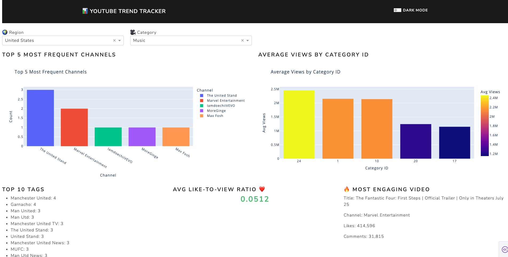

# 📊 YouTube Trends Analyzer



An end-to-end data engineering project that fetches, processes, analyzes, and visualizes real-time YouTube trending data using Python, MongoDB, Dash, and Mistral AI. It combines raw data ingestion with smart analytics and LLM-powered summaries to deliver a dynamic, interactive dashboard that uncovers what’s trending and why — all automated and ready for scale.


---

## 🔧 Features

- ✅ Fetches trending videos from the YouTube Data API (up to 200)
- ✅ Switch between **Basic (50 videos)** and **Deep (200 videos)** in dashboard
- ✅ Stores raw and cleaned data in MongoDB Atlas
- ✅ Cleans and normalizes video metadata using `pandas`
- ✅ Generates deep insights (top channels, tags, engagement, category stats)
- ✅ Stores trend summaries in a separate MongoDB collection
- ✅ Generates natural-language summaries with **Mistral AI**
- ✅ Displays LLM summaries directly in the dashboard UI
- ✅ Exports data to `.json` for backups and external analysis
- ✅ Interactive dashboard with **Plotly Dash** + Bootstrap themes
- ✅ Ready for automation via Airflow or scheduling tools


## 🚀 Quick Start

### 1. Clone the Repo

```bash
git clone https://github.com/attajunyah/youtube-trends-analyzer.git
cd youtube-trends-analyzer
```

### 2. Install Dependencies

```bash
pip install -r requirements.txt
```

### 3. Set Up Environment Variables

Create a `.env` file with your own keys:

```env
YOUTUBE_API_KEY=your_api_key_here
MONGO_URI=your_mongodb_connection_string
```

### 4. Run the Pipeline

```bash
python fetch_trending.py
python clean_trending.py
python analyze_trends.py
```

### 5. Launch the Dashboard

```bash
python dashboard.py
```

Visit `http://127.0.0.1:8050` in your browser.

---

## 🗂️ Project Structure

```
📦 youtube-trends-analyzer
├── fetch_trending.py           # Fetch trending videos from YouTube API
├── clean_trending.py           # Clean and normalize raw data
├── analyze_trends.py           # Analyze and summarize trends
├── deep_analysis_trending.py   # Fetch and analyze 200 trending videos
├── llm_summarize.py            # Generate natural language summaries using Mistral AI
├── deep_trending_videos.json   # Exported raw trending data
├── dash_app/
│   ├── app.py                  # Dash app entry point
│   ├── layout.py               # Dashboard layout and styling
│   ├── charts.py               # Plotly visualizations for analysis
│   └── utils.py                # MongoDB utility functions
├── .env                        # Environment variables (excluded from Git)
├── .gitignore
└── README.md

```

### 🧠 LLM-Powered Summaries


This project uses **Mistral AI** to automatically generate a weekly summary of YouTube trending video insights.

#### How It Works:
- Connects to MongoDB summary data (`trending_summary_deep`)
- Generates a natural language report using `mistral-large-latest`
- Summary is saved back to the DB and displayed on the dashboard

#### Example Output:
```
This week on YouTube, we've seen some exciting trends and top performers!

- Top Channels: ...
- Categories with High Views: ...
- Most Engaging Video: ...
```

---

### 🔍 File Overview

| File | Description |
|------|-------------|
| `llm_summarize.py` | Fetches trend summary and uses Mistral AI to write a weekly report |
| `dash_app/utils.py` | Now includes `get_llm_summary()` to fetch the report |
| `dash_app/layout.py` | Shows the LLM summary in a styled Dash card |

---

## 🌐 Live Demo

Coming soon...


## 🧠 Powered By

- [YouTube Data API](https://developers.google.com/youtube/v3)
- [MongoDB Atlas](https://www.mongodb.com/cloud/atlas)
- [Plotly Dash](https://dash.plotly.com/)
- `pandas`, `python-dotenv`, `certifi`, `pymongo`

---

## 📬 Contact

Built by [Frimpong Atta Junior Osei](https://github.com/attajunyah)

---

## 🛡️ MIT License

Let me know once it's live, and we’ll jump into the **Trend Tracker website build**!
